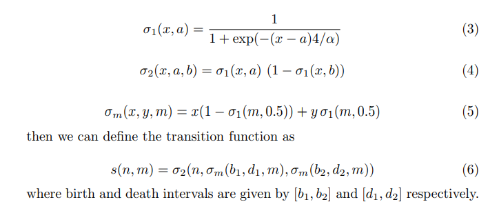
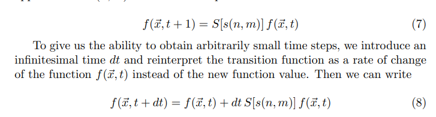
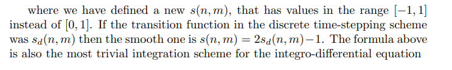
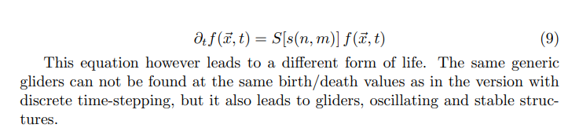

# ArtificalLife

A generalization of 2D discrete totalistic cellular automata to a continous domain with simulated smooth time stepping where each cell 
as values ranging from [0,1]. All aspects of the Game of life can be altered, the rules can be arbitrarily simple or complex leading to 
emergent phenomenon beyond our imaginations. What is important is the life and death conditionals which can be real numbers, ranges, fillings. here 
We determine it by the number of nieghbors and their filling values based on a radius when given postion (x,y) -> x^2 + y^2 <= radius.

# Papers used
Smooth Life : https://arxiv.org/pdf/1111.1567.pdf

Lenia Paper by Bert Wang-Chak Chan : https://arxiv.org/pdf/1812.05433.pdf

RealLife Paper : https://arxiv.org/pdf/math/0503504.pdf

state Integrals at time T for cell ~x:

State transition sigmoids and function:

"reinterpret the transition function as a rate of change
of the function f(~x, t) instead of the new function value"

Integro-differential time step equation:

