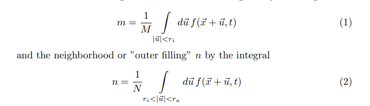

# ArtificalLife

# Papers used
Smooth Life : https://arxiv.org/pdf/1111.1567.pdf

state Integrals at time T for cell ~x:

State transition sigmoids and function:

"reinterpret the transition function as a rate of change
of the function f(~x, t) instead of the new function value"

Integro-differential time step equation:

